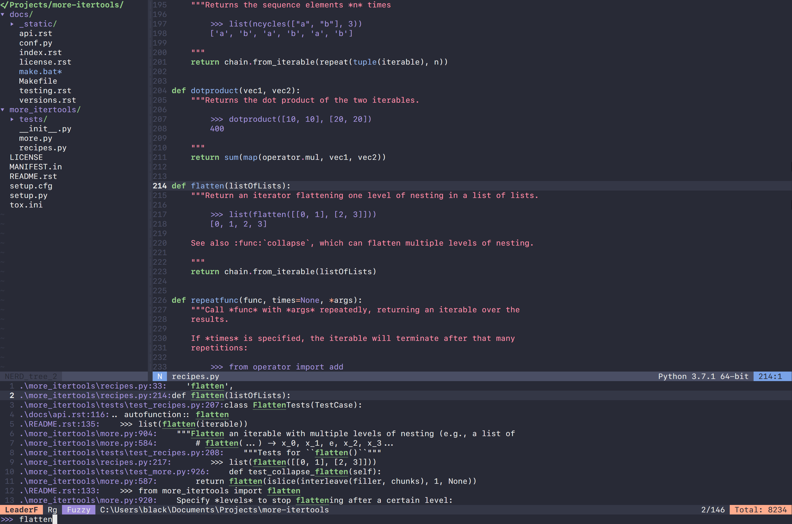

# Firark vim colorscheme

The Firark vim colorscheme is an implementation of the [Firark colors](https://github.com/alxkt/firark-colors) for the famous text editor Vim.

# Installation
- Using [vim-plug](https://github.com/junegunn/vim-plug)
```vim
Plug 'pulcinello/firark-vim/'
```

- Using [minpac](https://github.com/k-takata/minpac)
```vim
call minpac#add('pulcinello/firark-vim')
```

# Activation
```vim
set termguicolors
colorscheme firark
```

# TODO
- [ ] [LeaderF](https://github.com/Yggdroot/LeaderF) theme



